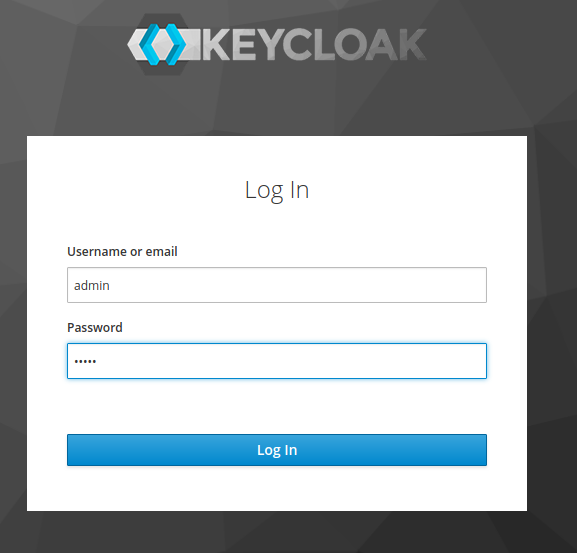
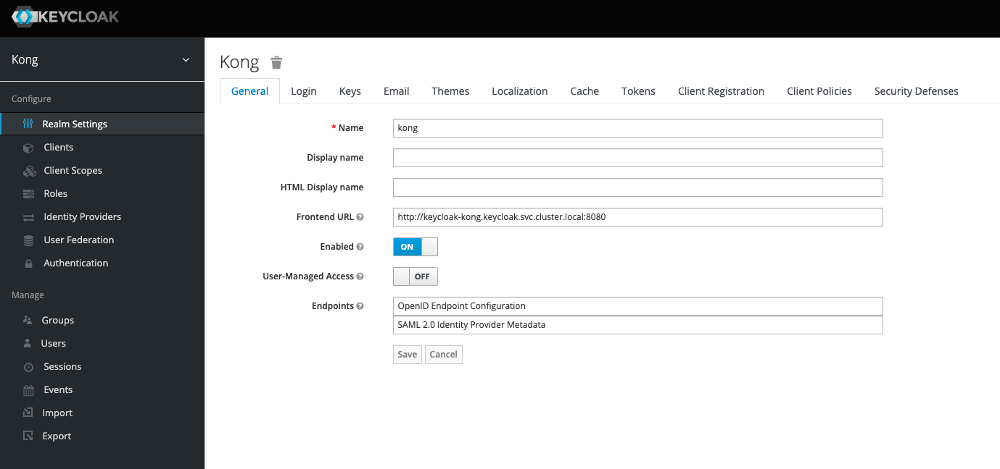
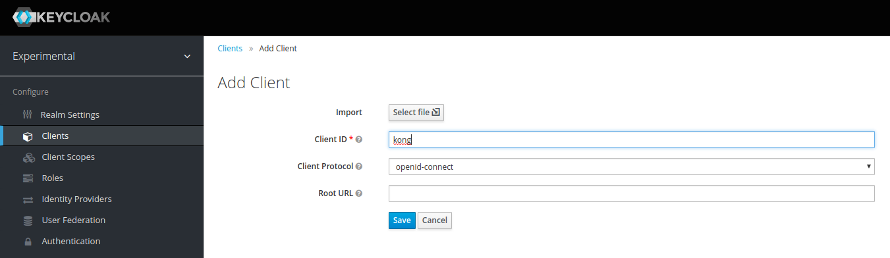
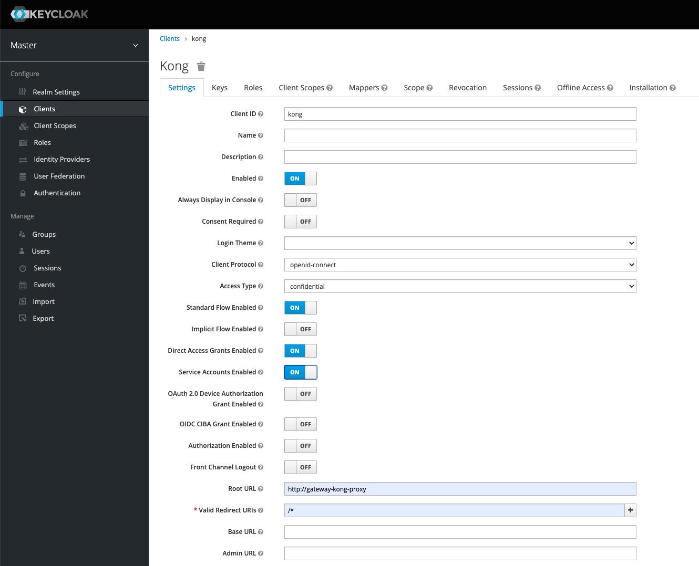
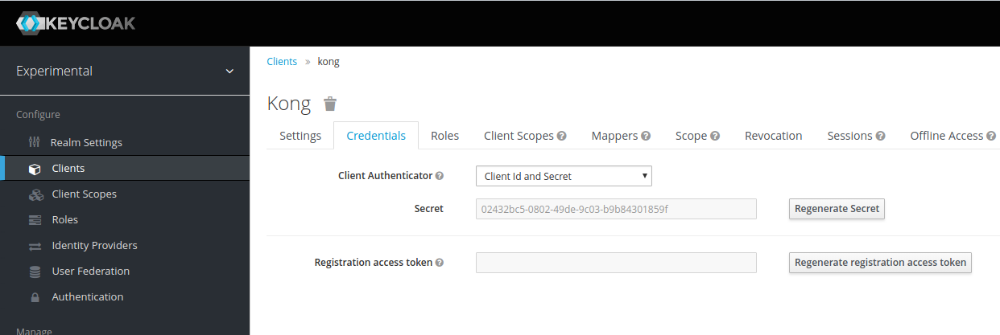
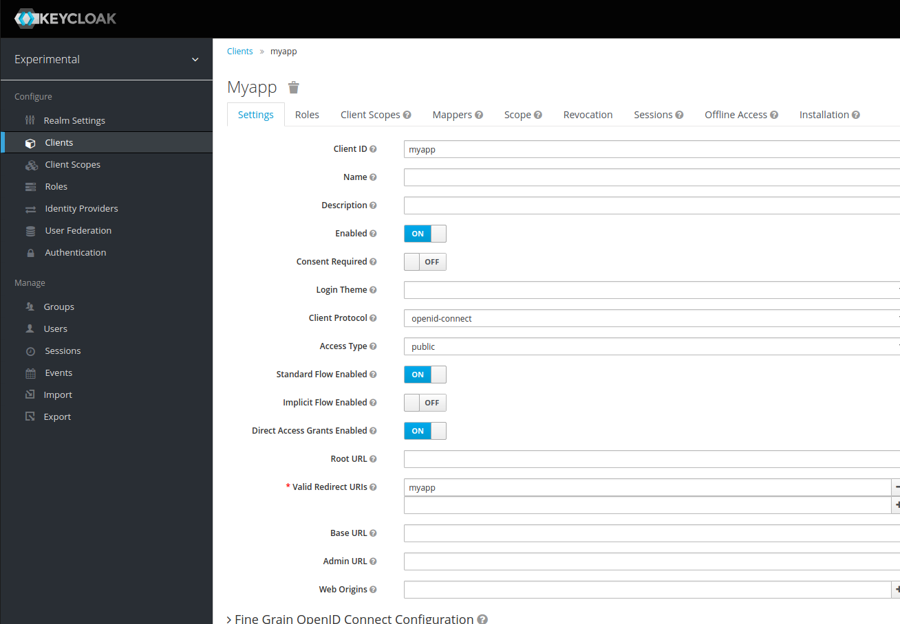
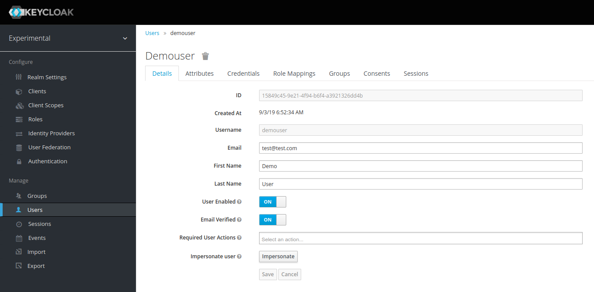
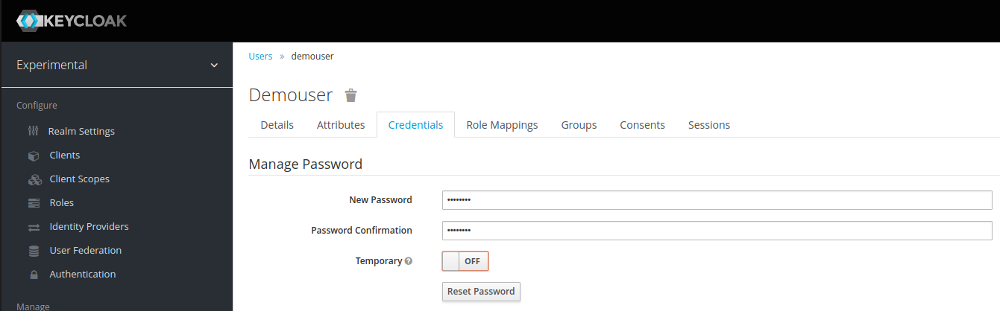
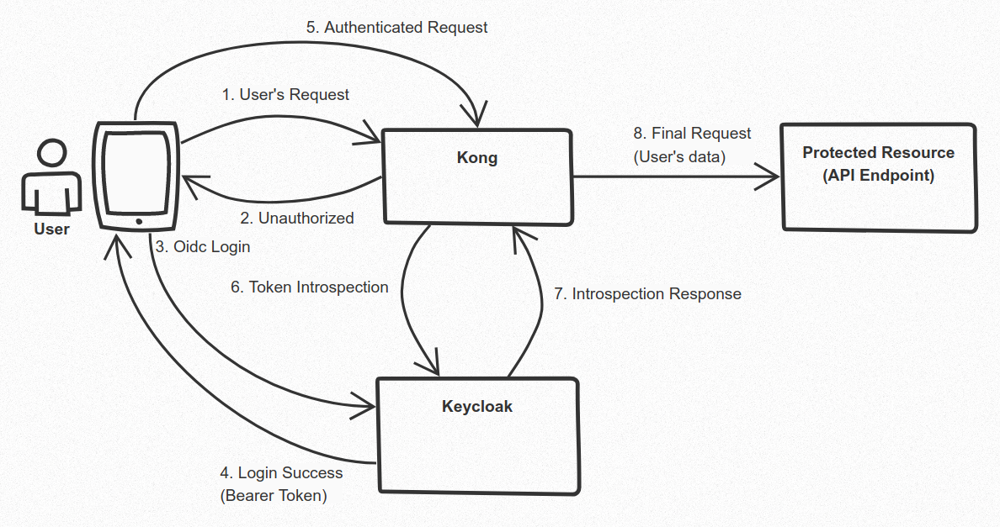

# Kong API Gateway on K8s - Ingress Mode / Keycloak: securing API through OIDC and Audit

This is a how to guide to configure Kong API Gateway running on k8s as Ingress controller with monitoring tools (Prometheus, Grafana and ELk), securing API through OIDC and log audit with body
 - To configure Kong OSS running in hybrid mode switch to branch: kong-hybrid-mode
 - To configure Kong Enterprise Free running in hybrid mode switch to branch: enterprise-free-hybrid

## Credits

[Kong / Konga / Keycloak: securing API through OIDC](https://github.com/d4rkstar/kong-konga-keycloak) by d4rkstar

## Dependencies

- [Docker](https://docs.docker.com/engine/install/)
- [Kind](https://kind.sigs.k8s.io/docs/user/quick-start/#installation)
- [Kubectl](https://kubernetes.io/docs/tasks/tools/)
- [Helm v3](https://helm.sh/docs/intro/install/)
- [jq](https://stedolan.github.io/jq/)


#### Install kubectl and helm using asdf

```bash
asdf plugin add kubectl
asdf plugin add helm
asdf install
```

## Create Kind cluster

```bash
kind create cluster --name kong --config=resources/kind.yaml
kind get kubeconfig --name kong > ~/.kube/kind-kong-config
```

## Setup kubectl

```bash
# Setup kubeconfig
export KUBECONFIG=~/.kube/kind-kong-config

# Testing configuration
kubectl get nodes
```

## Install LoadBalancer(metallb)

```bash
# Install metallb
sh resources/metallb/install-metallb.sh
```

## Install kong

```bash
# Install kong
sh config/install-kong.sh
```

```bash
# Deploy all Apps
kubectl apply -f apps --recursive
```
## Install Monitoring tools

```bash
# Install prometheus
sh resources/prometheus/install-prometheus.sh

# Apply prometheus plugin
kubectl apply -f kong-plugins/prometheus.yaml

# Install grafana
sh resources/grafana/install-grafana.sh

# Install Elastic Stack
sh resources/elk/install-elk.sh

# Apply tcp-log plugin
kubectl apply -f kong-plugins/tcp-log.yaml
```

## Setup `/etc/hosts`

> /etc/hosts
```bash
127.0.0.1 httpbin.local
127.0.0.1 grafana.local
127.0.0.1 prometheus.local
127.0.0.1 kibana.local
127.0.0.1 keycloak.local
```

## Services URLs

- [httpbin](http://httpbin.local)
- [prometheus](http://prometheus.local)
- [kibana](http://kibana.local)
- [grafana](http://grafana.local)
    - Username: `admin`
    - Password: `kong`

## Install Keycloak

```bash
# Install keycloak
sh resources/keycloak/install-keycloak.sh
```
### Configuration of realm and clients in Keycloak

- Login on [keycloak](http://keycloak.local)
    - Username: `admin`
    - Password: `admin`



- Create a new Realm in Keycloak

    Click on the button "Add Realm": this button appears when your mouse is over the realm
name (Master) on the upper left corner:



Fullfill this fields:

- _Name_: kong
- _Frontend URL_: http://keycloak-kong.keycloak.svc.cluster.local:8080

 - Create a new Kong Client in the realm , eg kong






Pay attention to the fields:

- _Client Protocol_: this account is for OIDC, so choose "openid-connect"
- _Access Type_: "confidential". This clients requires a secret to initiate the login process. This
  key will be used later on kong OIDC configuration.
- _Root Url_: http://gateway-kong-proxy
- _Valid redirect URLs_: /*

Under tab "Credentials", you'll find the Secret that we'll use to configure Kong OIDC:



- Now, create a second client, named "myapp".



The important thing here is the access type: "public" means that the login process needs users credentials to be
completed.

- Create a user

Click, from the left side menu, the item "Manage" > "Users", then click - from the right side - the "Add User" button.



Pay attention to the fields:

- _Email Verified_: you should set it to on

Go under "Credentials" tab and fill the fields "New password" and "Password
Confirmation" with the user's password. 

- _Temporary_: switch to "Off"



### Configure OIDC Kong Plugins

```bash
# Override client_secret on file kong-plugins/oidc.yaml
apiVersion: configuration.konghq.com/v1
kind: KongClusterPlugin
metadata:
  name: oidc
  annotations:
    kubernetes.io/ingress.class: "kong"
  labels:
    global: "false"
disabled: false # optionally disable the plugin in Kong
plugin: "oidc"
config: # configuration for the plugin
  client_id: "kong"
  client_secret: "your-client-secret"  # Client Secret Copied
  bearer_only: "yes"
  realm: "kong"
  introspection_endpoint: "http://keycloak.local/realms/kong/protocol/openid-connect/token/introspect"
  discovery: "http://keycloack.local/auth/realms/kong/.well-known/openid-configuration"
  scope: "openid"
```

### Apply oidc plugin to httpbin-service
```bash
# Configure plugin
kubectl apply -f kong-plugins/oidc.yaml

# Apply plugin to httpbin-service
kubectl apply -f apps/httpbin/ingress-oidc.yaml
```
### Test


```bash
# Should return 401
curl -I http://localhost:80 \
-H "Host:httpbin.local"
```

```bash
# Generate token
TKN=$(curl -s -X POST \
        -H "Content-Type: application/x-www-form-urlencoded" \
        -d "username=demouser" \
        -d "password=demopass" \
        -d 'grant_type=password' \
        -d "client_id=myapp" \
        http://keycloak.local/realms/kong/protocol/openid-connect/token \
        |jq -r '.access_token')
```
```bash
# Should return 200
curl -I http://localhost:80 \
-H "Host:httpbin.local" \
-H "Authorization: Bearer $TKN"
```
## Configure Autid Log

```bash
# Deploy Audit Server to store request and response body on ElasticSearch (Dependency: Elk resources)
sh resources/elk/install-audit-server.sh

# Apply kong-plugin to send data to Audit Server
kubectl apply -f kong-plugins/http-log-multi-body.yaml
```

```bash
# Apply configurations to ingress
kubectl apply -f apps/httpbin/ingress-with-audit.yaml
```

```bash
# This request should send data with body to ElasticSearch
curl -H "Host:httpbin.local" -X POST http://localhost/anything -d "hello=world"
```

```bash
# This don't send audit log with body to ElasticSearch
curl -H "Host:httpbin.local" http://localhost/anything
```
## Generate load

```bash
sh generate-load.sh
```

## Apply rate-limiting plugin to stop load

```bash
# apply rate-limiting plugin
kubectl apply -f kong-plugins/rate-limiting.yaml
```
```bash
# apply rate-limiting on httbbin route
kubectl apply -f apps/httpbin/ingress-rate-limiting.yaml
```

## Cleanup Kind

```bash
kind delete cluster --name kong
```

## Author

Managed by [Giovani Brioni Nunes](https://github.com/giovanibrioni)

## License

Apache 2 Licensed. See [LICENSE](https://github.com/giovanibrioni/kong-k8s/blob/master/LICENSE) for full details.